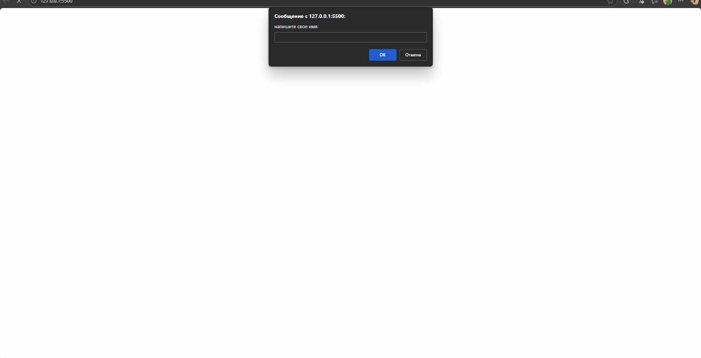

 Проект "Авторизация пользователя"

# Описание проекта
В данном проект показывает алгоритм автризации пользователя в системе.

# Цели проекта
Проект реализван для того чтобы показать алгоритм авторизации пользователя в системе.

# Используемые технологии
Для отображеня всплывающих окон используется HTML5,
JavaScript для реализациии функции проекта. Для отображения результа используется средство разработчика "консоль".

# Описание основных функций
`function authenticante()` - выполняет сравнение исходного логина и пароля с введёными пользователем данными.

`function login()` - запращивает у пользователя его логин и пароль, давая ему 3 попытки, если пользователь не вписал правильные данные за указанное количество попыток то выводится надписть "вы использовали все попытки, доступ заблокирован" и программа завершает свою работу.

Результат работы проекта отображается в консоли.

# Пример запуска
Для запуска проекта для начала вам необходимо его скачать после чего запустить файл index.html.

Пример ввода правильных данных:
Пример ввода неправильных данных:

Проект выполнен в образовательных целях на онлайн-курсе "Основы Python" школы "Лидер".
